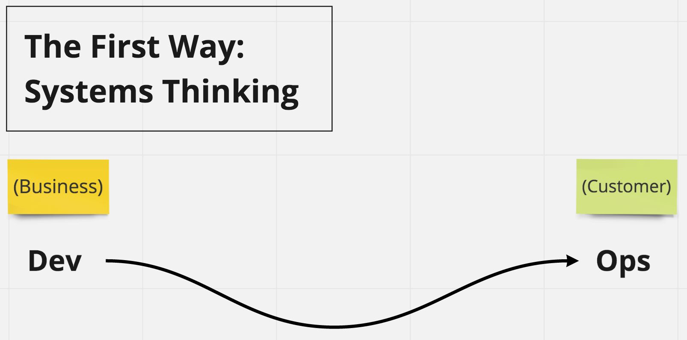
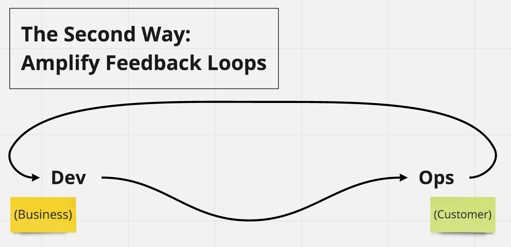
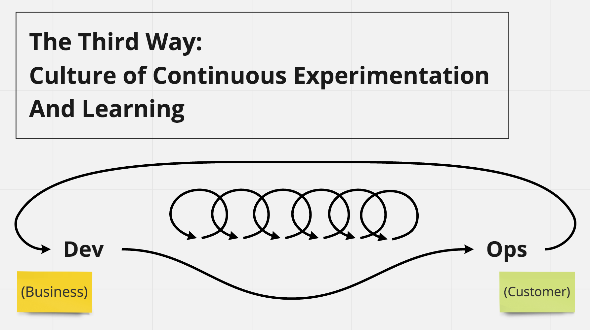

- title : The Three Ways
- description : The Principles Underpinning DevOps
- author : Márcio Azevedo
- theme : night
- transition : default

***

## [The Three Ways!](https://itrevolution.com/the-three-ways-principles-underpinning-devops/)

[Márcio Azevedo](https://github.com/marcio-azevedo)

<!-- 

-->

***

## The First Way
 
#### Systems Thinking

---

## Value Streams
#### From Requirements to shipped software to customers!

' It’s all about having a holistic view of the value stream, from requirements to shipped software to customers, or ' as they call, “it’s all about left to right“

---

### Assessment on the Performance of the entire system
##### How much time it takes do deploy a new line of code?
 
 

- It allows to apply Lean principles
    - Monitor WIP
    - Cycle Time
    - Lead Time
- Mean-Time-To-Repair (MTTR): elapsed time to repair a configuration item or IT service.
- Mean-Time-Between-Failure (MTBF): elapsed time between a service gets up and down.
- Mean-Time-To-Restore-Service (MTRS): elapsed time from the detection of an incident until it gets up.

---

### Focus is on all business value streams enabled by IT
 
#### Speed is THE Business Competitive Advantage!
 
#### Minimize [WIP](https://en.wikipedia.org/wiki/Work_in_process) to reduce company's investment before [ROI](https://en.wikipedia.org/wiki/Return_on_investment)!
 
' This enables assessment on the performance of the entire system – fast flow of work and it allows to apply known ' Lean principles, like monitor WIP
' Focus is on all business value streams enabled by IT

---

### The outcomes of putting the First Way into practice include:
 

- never passing a known defect to downstream work centers
- never allowing local optimization to create global degradation
- always seeking to increase flow
- always seeking to achieve profound understanding of the system

***

## The Second Way
 
#### Amplify Feedback Loops

---

### Understanding and responding to all customers, internal and external

---

### Shortening and amplifying all feedback loops

---

### Embedding knowledge where you need it

---

### Eradicate largest sources of **unplanned work**

***

## The Third Way
 
#### Culture of Continuous Experimentation And Learning

---

### Creating a culture that fosters two things:

- Continual experimentation, which requires taking risks and learning from success and failure
- Understanding that repetition and practice are the prerequisites to mastery, reinforcing a culture of operational rigor and discipline

---

### The outcomes of the Third Way include:

- allocating time for the improvement of daily work
- creating rituals that reward the team for taking risks
- introducing faults into the system to increase resilience

---

There’s a school of thought that says how high performers win in the marketplace is because they out-learn the competition, or as [Andrew Shafer](https://www.youtube.com/watch?v=NAazenCRQSY) said:

 

> **You’re either a learning organisation or you’re losing to somebody who is.**

' [Andrew Clay Shafer](https://www.linkedin.com/in/andrewclayshafer/)

***

- data-background : images/RequestForComment.gif

# So, what are you going to do about it!?

<!--  -->

***

## Thank you!

* [Presentation Source Code](https://github.com/marcio-azevedo/the-three-ways-presentation/) based on [FsReveal](https://github.com/fsprojects/FsReveal)

* References:
    * [The Phoenix Project book](https://itrevolution.com/book/the-phoenix-project/)
    * [https://anoblequest.wordpress.com/2018/06/13/the-phoenix-project/](https://anoblequest.wordpress.com/2018/06/13/the-phoenix-project/)
    * [The Three Ways: Principles Underpinning DevOps!](https://itrevolution.com/the-three-ways-principles-underpinning-devops/)
