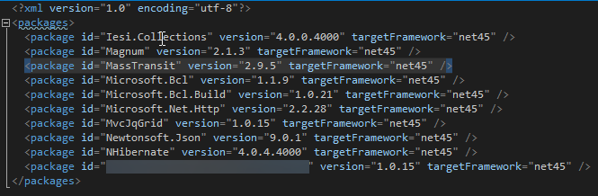
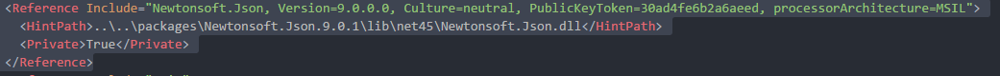
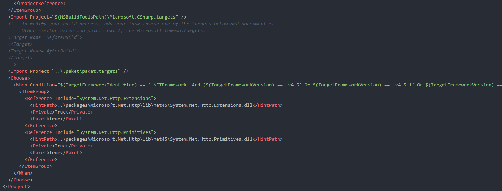
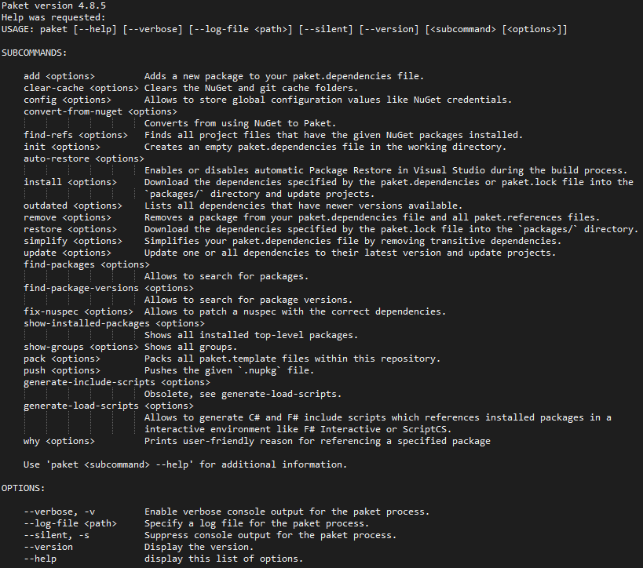
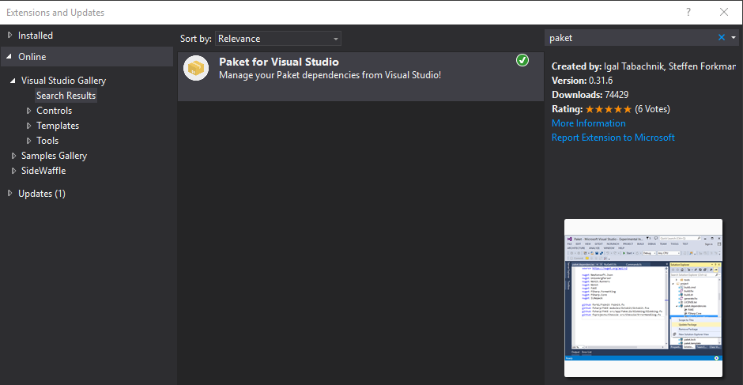

- title : The Three Ways
- description : The Principles Underpinning DevOps
- author : Márcio Azevedo
- theme : night
- transition : default

***

## [The Three Ways!](https://itrevolution.com/the-three-ways-principles-underpinning-devops/)


[Márcio Azevedo](https://github.com/marcio-azevedo)

<!--<br />

-->

***

## The First Way
#### Systems Thinking

---

## Value Streams
#### From Requirements to shipped software to customers!

' It’s all about having a holistic view of the value stream, from requirements to shipped software to customers, or ' as they call, “it’s all about left to right“

' This enables assessment on the performance of the entire system – fast flow of work and it allows to apply known ' Lean principles, like monitor WIP
' Focus is on all business value streams enabled by IT
' The outcomes of putting the First Way into practice include:
' never passing a known defect to downstream work centers
' never allowing local optimization to create global degradation
' always seeking to increase flow
' always seeking to achieve profound understanding of the system

---

- data-background : images/RequestForComment.gif

# So, what's the solution!?

<!--  -->

***

### PAKET
#### Dependency Manager for .NET (and Mono)


> **designed to work well with NuGet packages** and also
> enables referencing files directly from Git repositories or any HTTP resource.
' Why PAKET?
' PAKET offers **predictable control** over references with NuGet!
> It enables **precise and predictable control** over what packages the projects within your application reference.

---

' Here's some problems with NuGet command tool
## Known problems
### NuGet (the command tool) has no concept of transitive dependencies




---

### NuGet puts the package version in the path


' Problems: - path to packages changes at every update
' - code reviews are harder because you're always updating .csproj files
' - makes it very easy to have several versions of the same package in the same solution

---

### Updates may require manual work (specially if you update framework)




How PAKET does it?




' Neither Visual Studio neither NuGet are clever to update it when you change the project Framework.

---

#### Paket fully supports Semantic Versioning, and, currently, NuGet doesn’t (NuGet currently only supports SemVer 1.0.0).

> NuGet does not support SemVer-compatible (v2.0.0) prerelease numbers with dot notation, as in 1.0.1-build.23. You can use a form like 1.0.1-build23 but this is always considered a pre-release version.

in [PreRelease Semantic Versioning](https://docs.microsoft.com/en-us/nuget/create-packages/prerelease-packages#semantic-versioning)

Plan to implement [SemVer 2.0.0 support](https://github.com/NuGet/Home/wiki/SemVer-2.0.0-support)

***

#### PAKET is composed by _paket.bootstrapper.exe_

* Don't need to commit paket.exe to your repository
* Bootstrapper is available for download - [Bootstrapper](https://github.com/fsprojects/Paket/releases/latest)
* Bootstrapper allows to download latest paket.exe
* Can be used for CI build or from inside Visual Studio


' Main components
' http://fsprojects.github.io/Paket/paket-simplify.html#Sample
' open BackOffice example

---

#### Paket.exe (.paket directory in root)

```sh
$ .paket\paket.exe --help
```
[PAKET Commands](https://fsprojects.github.io/Paket//paket-add.html)

<!---->


---

### Global definition of dependencies
**paket.dependencies** (in solution root)

    source https://dotnet.myget.org/F/dotnet-core/api/v3/index.json

    // Reference a nuget package
    nuget FSharp.Management
    // Reference a single file from GitHub
    github myRepo/aProject dependency.dll
    github forki/FsUnit FsUnit.fs
    File:FsUnit.fs

    // Shared dependencies
    nuget Newtonsoft.Json
    nuget FSharp.Core

    group Web
        nuget Fake.IIS
        nuget Suave

    group Database
        nuget FluentMigrator
        nuget SQLProvider

' here's an example of ou to reference directly a dll from github or a script
' Reference multiple sources (NuGet, MyGet, Github, private NuGet servers, any HTTP resource!)
' ok, NuGet can do that as well, but how about reference directly HTTP resources?

---

### List of used versions for all dependencies
**paket.lock** (generated from paket install)

    NUGET
      remote: https://api.nuget.org/v3/index.json
        Microsoft.Bcl (1.1.9) - framework: >= net45
          Microsoft.Bcl.Build (>= 1.0.14)
        Microsoft.Bcl.Build (1.0.21) - import_targets: false, framework: >= net45
        Microsoft.Net.Http (2.2.28) - framework: >= net45
          Microsoft.Bcl (>= 1.1.9)
          Microsoft.Bcl.Build (>= 1.0.14)
        NuGet.CommandLine (3.5)

---

### Dependency definition per project ("replaces" packages.config)
**paket.references** (in each project folder)

    Microsoft.Net.Http
    Newtonsoft.Json

---

### Package definition for new packages
**paket.template** replaces the need for .nuspec file

    type file
    id Test.Paket.Package
    version 1.0
    authors Márcio Azevedo
    description
        description of this test package
    files
        src/Test.Paket.Package/bin/Debug ==> lib

[Detailed options](https://fsprojects.github.io/Paket/template-files.html)

***


### Some References

* [ElasticSearch.NET](https://github.com/elastic/elasticsearch-net) uses this in their .NET tools and libraries
* [Jet.com](https://github.com/jet/kafunk) (e-commerce platform recently acquired by Walmart by 3bn $)

***

' #### Convert from NuGet command
' [Convert from NuGet command](http://fsprojects.github.io/Paket/paket-convert-from-nuget.html)
' 
' 
' 
' [Here's a tutorial](https://fsprojects.github.io/Paket/convert-from-nuget-tutorial.html)

### DEMO


[Gists](https://gist.github.com/marcio-azevedo/9576969640a404fd2944aab89117d212)

***

### RECAP

* Plain text over Command line tool
* Direct vs. transitive dependencies
* Only one version of a package

There's also a VS extension - [Paket.VisualStudio](https://github.com/hmemcpy/Paket.VisualStudio)

' 


---

## Q&A
#### Paket - Project Principles:

* Integrate well into the existing NuGet ecosystem
* Make things work with minimal tooling (plain text files)
* Make it work on all platforms
* Automate everything
* Create a nice community

' 
' yes, it's possible to have different versions for the same package - https://russcam.github.io/paket-fake-talk/#/same-dependency
' Global view of dependencies - used where and by whom? (NuGet has no global view of your dependencies)
' Package Dependency Resolution

***

## Thank you!

* [Presentation Source](https://github.com/marcio-azevedo/paket-presentation/) based on [FsReveal](https://github.com/fsprojects/FsReveal)
* [Gists](https://gist.github.com/marcio-azevedo/9576969640a404fd2944aab89117d212)

* References:
    * https://fsprojects.github.io/Paket/
    * https://russcam.github.io/paket-fake-talk/#/intro
    * http://forki.github.io/PaketIntro/#/
